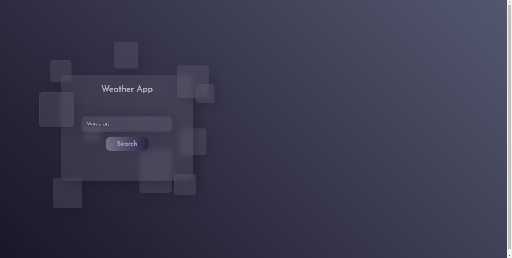
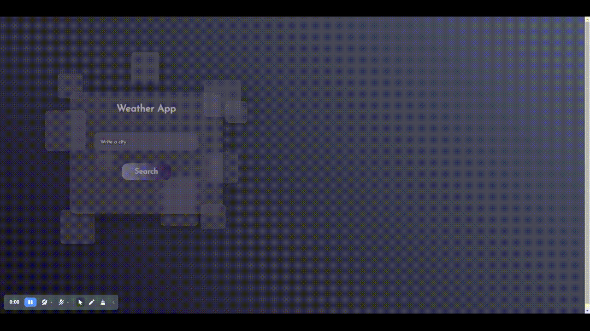
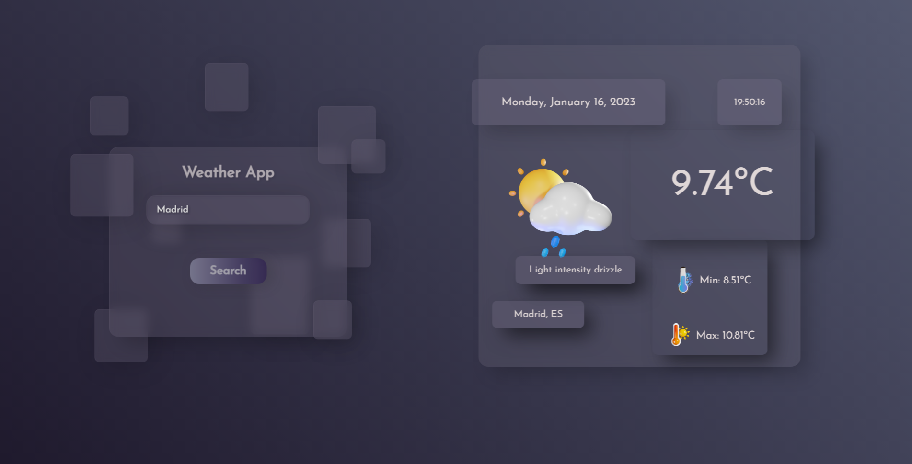

# 💻 CITY WEATHER APP

## 🔧 Built with....
- React(Redux) - a client-side JavaScript framework
- OpenWeatherMap - https://openweathermap.org/api
## 🚀 Getting Started - Installation

1. To deploy this project you must clone the  repository through the following link:

```
https://github.com/Sif03/Weather-App
```

2. Install all dependecies

```
npm i
```

3. Run the project!
```
npm run dev or npm run start
```

##  Weather App Preview

### 1. Search City Preview




### 2. Display City Weather Preview



## 🧑‍💼 Author

👤 **Sif**

- Github: [@Sif03](https://github.com/Sif03)
 
This project was developed By [Sif03](https://github.com/Sif03)